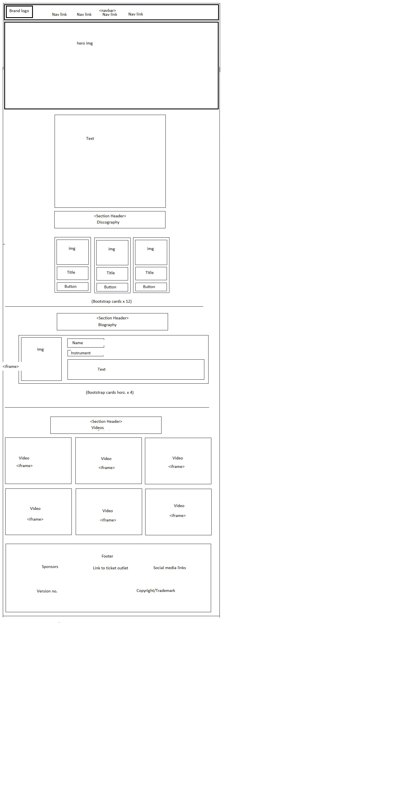
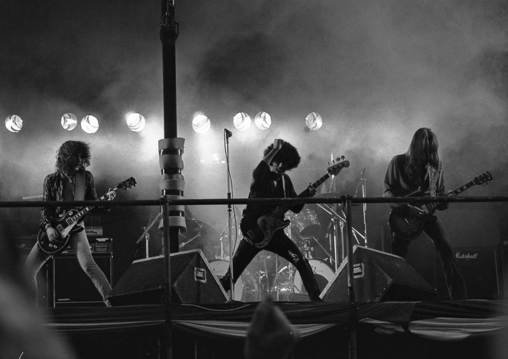

# Peter Kellett - User Centric Frontend Development Milestone Project

## PROJECT PURPOSE
The purpose of this project is to construct a website in order to provide a brief overview about a musical band. It includes short intro, the band discography, a brief bio on each band member, and a selection of videos. There is also provision for a user to sign up to an electronic fanzine editorial.
It shall also demonstrate my ability to structure and compile the necessary HTML and CSS code to construct a website to showcase the above features and which is responsive to various devices.

## Technologies
- Bootstrap v4.3.1
- FontAwesome v5.11.2
- Google Fonts
- AWS Cloud9
- GitHub repository PeterKellett/Project-1
- Demo link https://peterkellett.github.io/Project-1/

## UX
This website shall contain 2 pages.
1. Home page
    - Intro (Home)
    - Discography
    - Biography
    - Videos
2. Contact Us page

## USER STORIES
A user requires the need to be able to easily navigate between the respective sections in any order without the need to return to a home section.
A user needs to be able to read an overview of the band.
A user needs to be able to view information on the bands albums.
A user needs to be able to view information on the band members.
A user needs to be able to view videos of the band.
A user needs to be able to sign up to a fanzine electronic magazine.

## WIREFRAMES

## FEATURES
### Navigation Menu
The navigation menu is composed of pill style links directing users to the relevant section of the page selected.

### Home Page/home
index.html#home-bookmark
The main section of the homepage contains a hero image and a brief overview description of the band Thin Lizzy.

### Home Page/Discography
index.html#discography-bookmark
The discography section contains a bootstrap card for each of the 12 albums the band has released. They are styled bootstrap cards consisting of an image, an album title, and a button which opens a model displaying the album song list.

### Home Page/Biography
index.html#biography-bookmark
The biography section displays 4 no. band members on horizontal bootstrap cards.
- 
- card background-color: #00000085;

### Home Page/Videos
index.html#videos-bookmark
6 no. videos are displayed.
- 
- width: 100%;
- height: 350px;

### Contact Us page
contact.html#contact-us-bookmark
The contact us page consists of a form with 3 input fields and a submit button.
- 
- form background-color #00000085
- Input fields have attribute [required]

### Footer
The footer consits of 3 section.
- Sponsors
- Newsletter
    - Email field
    - Submit button
- Social media links
    - Facebook icon link
    - Twitter icon link
    - Instagram icon link
    - Youtube icon link

